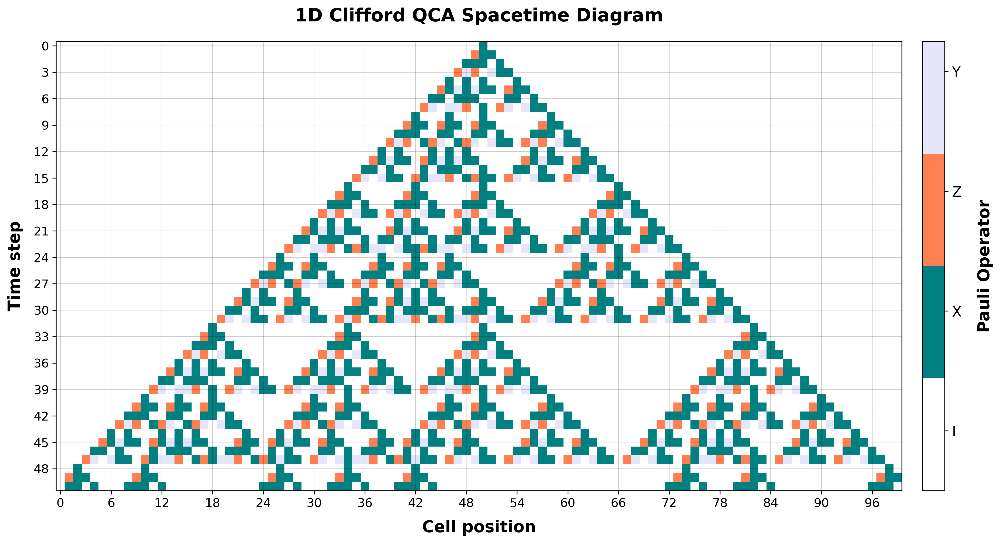

# 1D Clifford QCA Simulator

[](https://your-app-url-here)

An interactive web application for simulating and visualizing 1-Dimensional Clifford Quantum Cellular Automata (QCA). This simulator demonstrates the evolution of Pauli operators through a 1D lattice over time, providing insights into quantum information propagation.



## Features

- Interactive simulation of 1D Clifford QCA
- Real-time visualization of quantum state evolution
- Customizable simulation parameters:
  - Number of cells (lattice size)
  - Number of time steps
  - Local update rules
- Multiple initial state options:
  - Single active cell
  - Random configuration
  - Manual Pauli string input
- Beautiful spacetime diagram visualization
- Intuitive web interface built with Streamlit

## Installation

1. Clone the repository:
```bash
git clone https://github.com/Florian2Richter/clifford-qca-1d.git
cd clifford-qca-1d
```

2. Install dependencies:
```bash
pip install -r requirements.txt
```

## Usage

Run the Streamlit app:
```bash
streamlit run app.py
```

The app will open in your default web browser. You can then:
1. Adjust the number of cells and time steps
2. Set the local rule matrix (2x6 over F2)
3. Choose an initial state configuration
4. Watch the QCA evolution in the spacetime diagram

## Mathematical Background

The simulator implements a 1D Clifford Quantum Cellular Automaton, where:
- Each cell state is represented by a Pauli operator (I, X, Z, or Y)
- The evolution is governed by a local update rule in the form of a 2x6 matrix over F2
- The global update preserves the Clifford group structure
- Periodic boundary conditions are applied

## Contributing

Contributions are welcome! Please feel free to submit a Pull Request.

## License

This project is licensed under the MIT License - see the [LICENSE](LICENSE) file for details.

## Citation

If you use this simulator in your research, please cite:
```bibtex
@software{clifford_qca_1d,
  author = {Richter, Florian},
  title = {1D Clifford QCA Simulator},
  year = {2024},
  url = {https://github.com/Florian2Richter/clifford-qca-1d}
}
```
